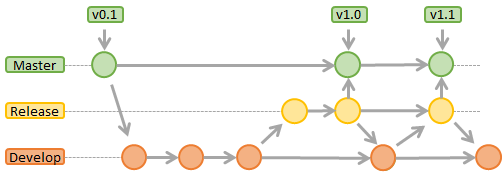
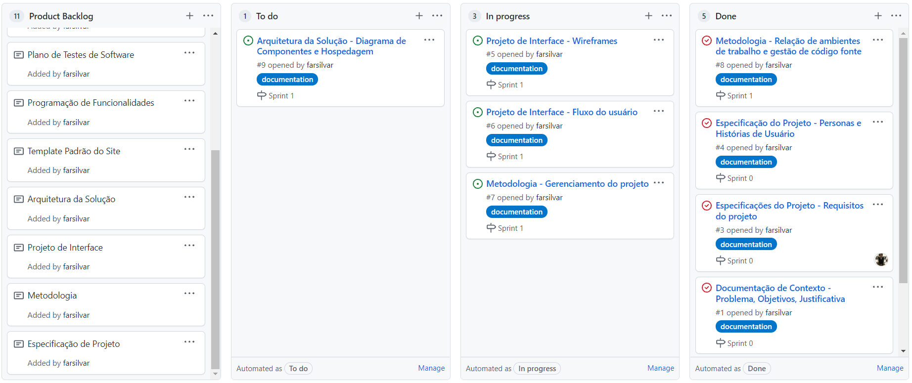

# Metodologia

A metodologia contempla as definições de ferramental utilizado pela equipe tanto para a manutenção dos códigos e demais artefatos quanto para a organização do time na execução das tarefas do projeto.

## Relações de Ambientes de Trabalho

Os artefatos do projeto são desenvolvidos a partir de diversas plataformas e a relação dos ambientes com seu respectivo propósito é apresentada na tabela que se segue.

| Ambiente | Plataforma                           | Link de acesso                                     |
| -------------------- | ------------------------------------------------------------ | ----------------------------------------------------------- |
| Repositório de código fonte | GitHub | https://github.com/ICEI-PUC-Minas-PMV-ADS/pmv-ads-2021-2-e1-proj-web-t1-grupo-5-libras |
| Documentos do projeto | GitHub | https://github.com/ICEI-PUC-Minas-PMV-ADS/pmv-ads-2021-2-e1-proj-web-t1-grupo-5-libras |
| Projeto de Interface e  Wireframes | Figma | https://www.figma.com/file/q5KkDPr7ooeopIRWHSC7AW/projeto-libras?node-id=0%3A1 |
| Gerenciamento do Projeto | GitHub | https://github.com/ICEI-PUC-Minas-PMV-ADS/pmv-ads-2021-2-e1-proj-web-t1-grupo-5-libras/projects |

## Gestão de código fonte

Para gestão do código fonte do software desenvolvido pela equipe, o grupo utiliza um processo baseado no Git Flow abordado por Vietro (2015), mostrado na Figura a seguir. Desta forma, todas as manutenções no código são realizadas em branches separados, identificados como Release e Develop.

 Figura 1 - Fluxo de controle do código fonte no repositório git 

## Gerenciamento do Projeto

A equipe utiliza metodologias ágeis, tendo escolhido o Scrum como base para definição do processo de desenvolvimento.

A equipe está organizada da seguinte maneira:
 - Scrum Master: Felipe Augusto
 - Product Owner: Bruno Passos
 - Equipe de Desenvolvimento:
   - Bruno Passos
   - Débora Brito
   - Leonardo Friedrich
 - Equipe de Design
   - Leonardo Friedrich

Para organização e distribuição das tarefas do projeto, a equipe está utilizando o GitHub, estruturado com as seguintes listas: 

 - Backlog: recebe as tarefas a serem trabalhadas e representa o Product Backlog. Todas as atividades identificadas no decorrer do projeto também devem ser incorporadas a esta lista.
 - To Do: Esta lista representa o Sprint Backlog. Este é o Sprint atual que estamos trabalhando.
 - In progress: Quando uma tarefa tiver sido iniciada, ela é movida para cá.
 - Done: nesta lista são colocadas as tarefas que passaram pelos testes e controle de qualidade e estão prontos para serem entregues ao usuário. Não há mais edições ou revisões necessárias, ele está agendado e pronto para a ação.

 

