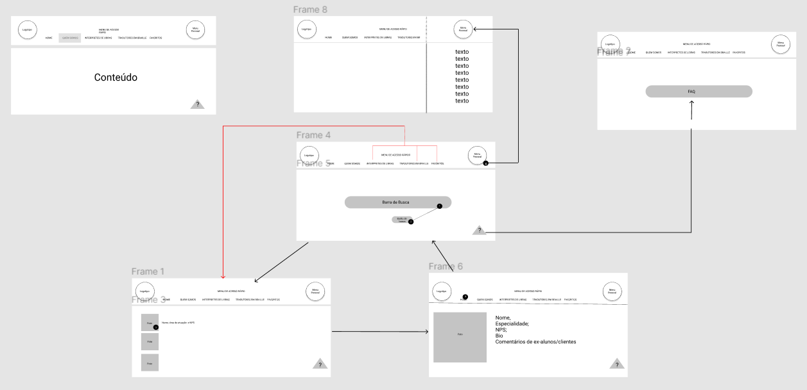
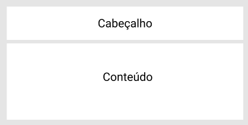
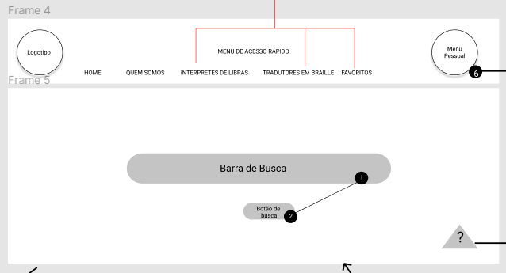
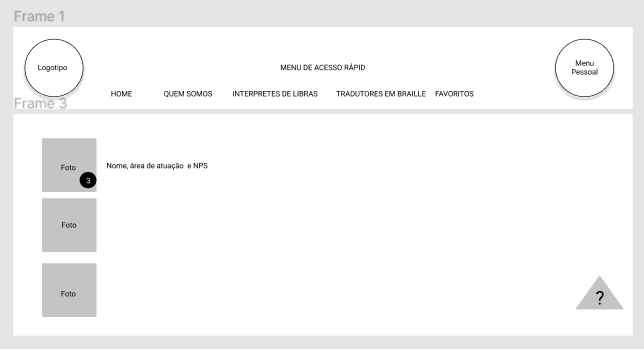
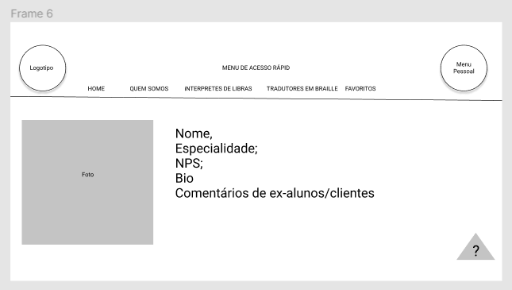
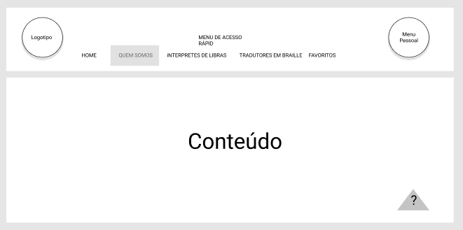
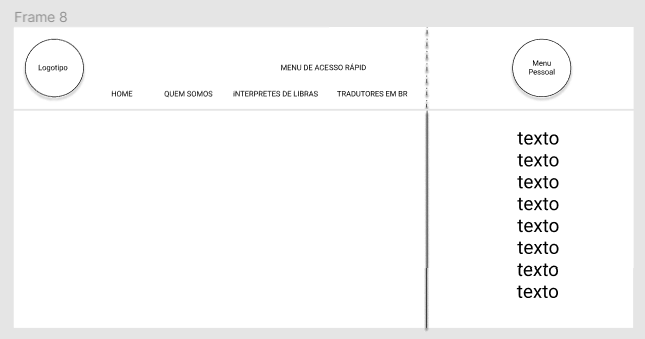

# Projeto de Interface

Dentre as preocupações para a montagem da interface do sistema, estamos estabelecendo foco em questões como agilidade, acessibilidade e usabilidade. Desta forma, o projeto tem uma identidade visual padronizada em todas as telas que são projetadas para funcionamento em desktops e dispositivos móveis.

## User Flow

O diagrama apresentado na figura abaixo mostra o fluxo de interação do usuário pelas telas do sistema. Cada uma das telas deste fluxo é detalhada na seção de Wireframes que se segue. Para visualizar o wireframe interativo, acesse o [ambiente Figma do projeto](https://www.figma.com/file/q5KkDPr7ooeopIRWHSC7AW/projeto-libras?node-id=0%3A1).

 Fgura 1: Fluxo do usuário proposto para o site de intérprete de LIBRAS 

## Wireframes

Conforme fluxo de telas do projeto, apresentado no item anterior, as telas do sistema são apresentadas em detalhes nos itens que se seguem. As telas do sistema apresentam uma estrutura comum que é apresentada na figura abaixo. Nesta estrutura, existem 3 grandes blocos, descritos a seguir. São eles:

 - **Cabeçalho** - local onde são dispostos elementos fixos de identidade (logo) e navegação principal do site (menu da aplicação);
 - **Conteúdo** - apresenta o conteúdo da tela em questão;

 Figura 2: Layout básico das telas do site 

### Tela - Home-Page

A tela de home-page mostra a barra de busca a partir da API utilizada pelo sistema. 
Com base na estrutura padrão, o bloco de Conteúdo a barra onde o usuário insere as informações do intérprete desejado ou do assunto específico da aula desejada.

### Tela de profissionais

A tela de profissionais apresenta os principais intérpretes já contratados pelo usuário, bem como o resultado da pesquisa dos intérpretes para a determinada matéria ou aula realizada na aba de busca.

### Tela do perfil do profissional

A tela apresenta de maneira mais detalhada as informações do perfil do profissional escolhido pelo usuário, tanto no ato da pesquisa, quanto ao escolher um profissional o qual já estava salvo entre seus favoritos.

### Quem somos

Tela contendo as informações dos responsáveis pelo site, bem como a introdução e proposta do site como um todo.

### Menu lateral para configurações

Tela lateral que é apresentada quando o usuário clica em Menu Pessoal. Essa tela apresenta as informações do usuário, além de permitir que o mesmo realize configurações do seu usuário, como redefinição de foto, senha, etc.

